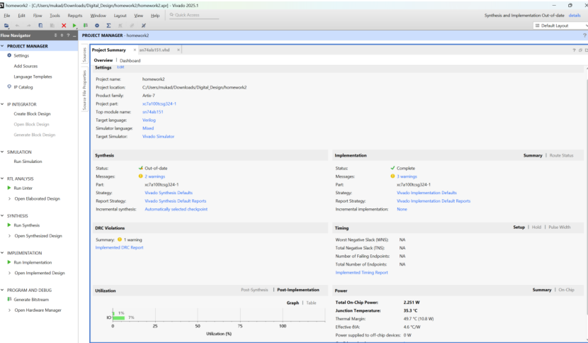
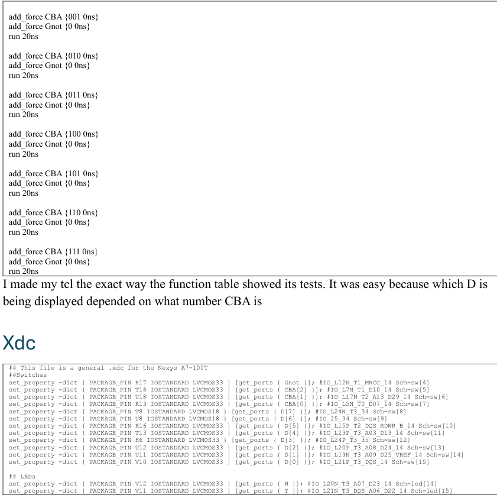
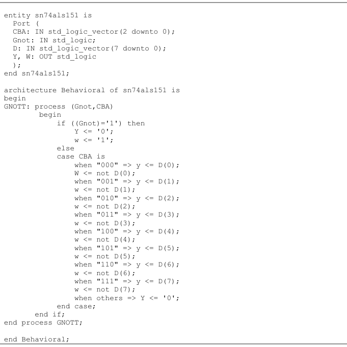
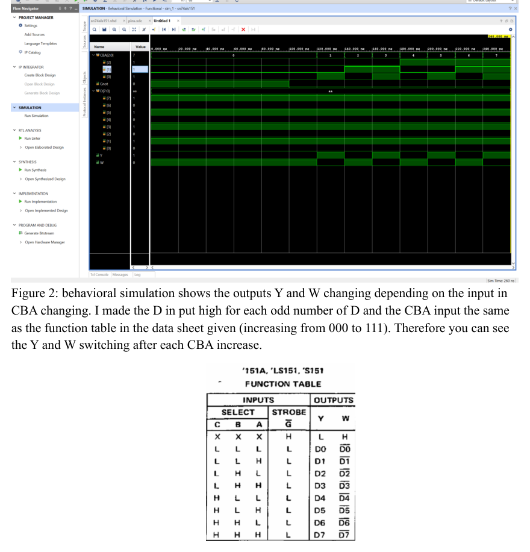

# SN74ALS151 8:1 Data Selector (VHDL) — Nexys A7

This repo is a behavioral **VHDL implementation of the TI SN74ALS151** (1-of-8 data selector / multiplexer), targeted to the **Xilinx Artix-7** on the **Nexys A7** board.

The assignment goal: write the mux using a `process` + `case`, run Vivado **implementation**, and verify functionality using a **Tcl force script** and simulation waveforms.

---

## GitHub title ideas

Pick one:

- **SN74ALS151 8:1 Multiplexer (VHDL) — Nexys A7**
- **sn74als151-vhdl-nexys-a7**
- **VHDL 8-to-1 Data Selector (SN74ALS151 clone)**

## GitHub description (1–2 sentences)

Behavioral VHDL clone of the TI SN74ALS151 8:1 mux (data selector) mapped to a Nexys A7, with Vivado implementation + a Tcl force script that steps through the datasheet-style select cases and checks Y/W outputs.

---

## How it works (chip behavior)

Inputs:
- `D[7:0]` — data inputs  
- `CBA[2:0]` — select lines (C is MSB, A is LSB)  
- `Gnot` — active-low enable / strobe

Outputs:
- `Y` — selected data output  
- `W` — inverted output (basically `not Y` in normal operation)

Rules:
- If `Gnot = '1'` (disabled), the outputs are forced: `Y='0'`, `W='1'`
- If `Gnot = '0'`, `CBA` chooses which `D(n)` routes to `Y`, and `W` is the inverse

---

## Code snippet (core mux logic)

```vhdl
process (Gnot, CBA, D)
begin
  if Gnot = '1' then
    Y <= '0';
    W <= '1';
  else
    case CBA is
      when "000" => Y <= D(0); W <= not D(0);
      when "001" => Y <= D(1); W <= not D(1);
      when "010" => Y <= D(2); W <= not D(2);
      when "011" => Y <= D(3); W <= not D(3);
      when "100" => Y <= D(4); W <= not D(4);
      when "101" => Y <= D(5); W <= not D(5);
      when "110" => Y <= D(6); W <= not D(6);
      when "111" => Y <= D(7); W <= not D(7);
      when others => Y <= '0'; W <= '1';
    end case;
  end if;
end process;
```

---

## Test script (Tcl force pattern)

The included Tcl sequence does what you’d do by hand:
- hold `D = 10101010`
- enable the chip (`Gnot = 0`)
- step `CBA` from `000` → `111`
- watch `Y` match the selected `D(n)` and `W` invert

```tcl
restart
add_force CBA  {000 0ns}
add_force Gnot {1   0ns}
add_force D    {10101010 0ns}
run 100ns

add_force Gnot {0 0ns}
run 20ns
add_force CBA {001 0ns}
run 20ns
...
add_force CBA {111 0ns}
run 20ns
```

---

## Pin mapping (Nexys A7 switches + LEDs)

This project maps everything to on-board switches and LEDs so you can test without external wiring.

**Switches**
- `Gnot`  → `SW4`
- `CBA[2:0]` → `SW5..SW7`
- `D[7:0]` → `SW8..SW15`

**LEDs**
- `Y` → `LED15`
- `W` → `LED14`

---

## Screenshots

### Project summary + Tcl excerpt


### XDC + rest of Tcl stepping


### VHDL source


### Behavioral simulation + function table


---

## Run it (Vivado)

1. Create a Vivado project for **Nexys A7** (Artix-7).
2. Add the VHDL file (`sn74als151.vhd`).
3. Add your `.xdc` constraints.
4. Run:
   - **Behavioral simulation** (optional)
   - **Implementation**
   - **Post-route simulation** (recommended) + `source` the Tcl script
5. Flip `CBA` and confirm `Y/W` match the datasheet function table.

---

## Report 

The write-up + screenshots are in the submitted PDF under `report/`.


## Demo video

I also have a video uploaded above showing the project functioning.
